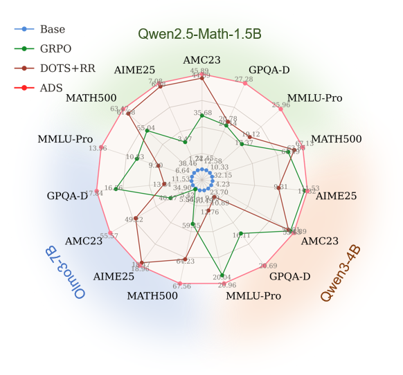
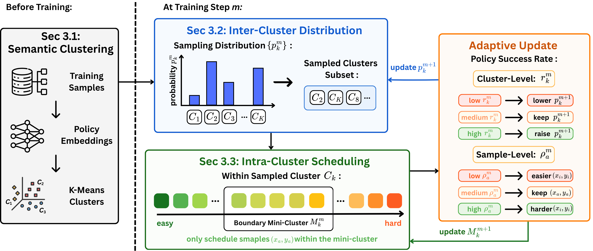
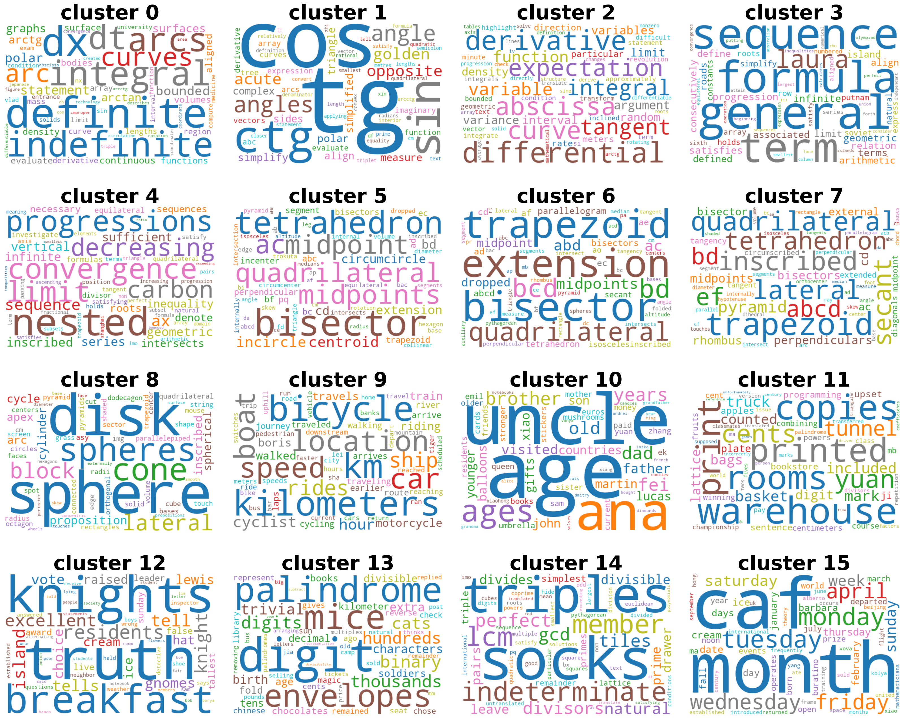

<div align="center">

# ADS: Adaptive Data Scheduling for Data-Efficient LLM Reinforcement Learning

<p>
  <a href="#"></a>
  <a href="https://github.com/Richard-zrx/ADS"></a>
  <a href="https://huggingface.co/RoadQAQ/Qwen2.5-Math-1.5B-16k-think"></a>
  <a href="LICENSE"></a>
  
</p>

<em>Train reasoning LLMs with far fewer rollouts by scheduling <strong>which</strong> problems to learn from, and <strong>at what difficulty</strong>, throughout RL.</em>

<p>
  <a href="#-about">About</a> ·
  <a href="#-paper-results">Results</a> ·
  <a href="#-installation">Installation</a> ·
  <a href="#-pipeline--training">Pipeline & Training</a> ·
  <a href="#-how-ads-works">How ADS Works</a> ·
  <a href="#-citation">Citation</a>
</p>

</div>

## 🎉 Updates

- **[06/2026]** Initial open-source release: the full ADS data pipeline + the GRPO training entrypoint that plugs the ADS sampler into [verl](https://github.com/volcengine/verl).

## 💡 About

**ADS (Adaptive Data Scheduling)** is a dual-level data scheduler for LLM reinforcement learning. Standard GRPO draws prompts **uniformly**, ignoring both the semantic structure of the data and the changing ability of the policy. ADS replaces uniform sampling with an adaptive schedule along two axes:

- **Inter-cluster — *which* problems.** The dataset is partitioned into semantic clusters; ADS samples each in proportion to its smoothed running success rate, concentrating compute on clusters the policy is actively learning.
- **Intra-cluster — *at what difficulty*.** Within each cluster, problems are difficulty-sorted; ADS tracks a boundary mini-cluster near ~50% success and slides it easier/harder as the policy improves, keeping rollouts on the most informative samples.
- **Results.** Across **3 LLMs** and **7 reasoning benchmarks**, ADS beats GRPO by **+5.2%** average accuracy, and the gains transfer across objectives (OPD, DAPO, GSPO) and scales (1.5B → 4B → 7B).

<div align="center">
  
  <br>
  <em>ADS (red) vs. Base, GRPO, and DOTS+RR across three LLMs and five reasoning datasets.</em>
</div>

## 🎯 Paper Results

**Mean@16 accuracy (%)** on seven math and OOD scientific reasoning benchmarks. Best within each model group is **bold**; ADS deltas are vs. GRPO.

| Model | Method | MATH-500 | AIME 25 | AIME 24 | Minerva | AMC 23 | GPQA-D | MMLU-Pro | **Average** |
|---|---|:--:|:--:|:--:|:--:|:--:|:--:|:--:|:--:|
| **Qwen2.5-Math-1.5B** | Base     | 38.46 | 1.74 | 2.64 | 8.90 | 22.45 | 12.58 | 10.33 | 13.87 |
|                       | GRPO     | 55.04 | 3.47 | 5.63 | 13.63 | 35.68 | 20.14 | 17.37 | 21.57 |
|                       | DOTS+RR  | 61.68 | 6.88 | 8.75 | 14.79 | 44.89 | 20.78 | 19.12 | 25.27 |
|                       | **ADS**  | **63.47** | **7.08** | **9.44** | **17.20** | **45.89** | **27.28** | **25.96** | **28.05** `(+6.48)` |
| **Qwen3-4B-Base**     | Base     | 32.15 | 4.23 | 5.83 | 10.27 | 23.70 | 9.69 | 10.49 | 13.77 |
|                       | GRPO     | 61.49 | 11.32 | 12.22 | 18.40 | 53.65 | 16.11 | 20.04 | 27.60 |
|                       | DOTS+RR  | 63.85 | 9.31 | **14.09** | **21.35** | 52.91 | 10.89 | 12.76 | 26.45 |
|                       | **ADS**  | **67.13** | **11.53** | 12.50 | 20.89 | **54.89** | **20.69** | **20.96** | **29.80** `(+2.20)` |
| **Olmo3-7B-SFT**      | Base     | 54.71 | 5.42 | 4.31 | 16.37 | 34.90 | 11.53 | 6.64 | 19.13 |
|                       | GRPO     | 59.35 | 5.56 | 6.67 | 17.21 | 40.47 | 16.56 | 10.83 | 22.38 |
|                       | DOTS+RR  | 64.23 | 18.47 | 15.28 | 17.16 | 49.22 | 13.34 | 9.20 | 26.70 |
|                       | **ADS**  | **67.56** | **18.96** | **18.33** | **18.58** | **55.57** | **17.84** | **13.56** | **30.06** `(+7.68)` |

- **Consistent across scales** — ADS is the best method on 1.5B, 4B, and 7B backbones.
- **Strong OOD generalization** — gains hold on **GPQA-D** and **MMLU-Pro**, so ADS strengthens general reasoning, not just math patterns.
- **Objective-agnostic** — ADS improves over the baseline on top of OPD, DAPO, and GSPO (Table 2 in the paper).

## 🚀 Installation

```bash
git clone https://github.com/Richard-zrx/ADS.git ads && cd ads
conda create -n ads python=3.10 -y && conda activate ads
pip install -r requirements.txt                        # data pipeline
pip install -e verl                                    # training framework (vendored verl)
pip install flash-attn==2.8.3 --no-build-isolation     # recommended for training
```

## 🧪 Pipeline & Training

ADS is **dataset-agnostic** — one command takes your RL training set from raw data to a trained model:

```bash
# DATASET = a Hugging Face Hub id or a local .parquet / .json / .jsonl
DATASET=<org/name> CUDA_VISIBLE_DEVICES=0,1,2,3 bash scripts/run_ads.sh
```

This threads `DATASET` through the three stages below — format the data, build the cluster- and difficulty-labeled training set, then run GRPO with the ADS sampler.

### 1. Prepare data

`prepare_custom_dataset.py` converts any math dataset — a Hub id or a local `.parquet`/`.json`/`.jsonl` — into the VeRL/GRPO schema:

```bash
python scripts/prepare_datasets/prepare_custom_dataset.py --dataset <org/name> --output-name myds  # -> dataset/myds/train.parquet
python scripts/prepare_datasets/run_all.py                                                          # eval sets: AIME 2024/2025, MATH-500
```

See [`scripts/prepare_datasets/README.md`](scripts/prepare_datasets/README.md) for the full output schema.

### 2. Build the ADS training set

Embedding → K-Means clustering → NLL difficulty → difficulty-sort within clusters:

```bash
INPUT_DATA=dataset/myds/train.parquet OUTPUT_BASE=outputs/myds CUDA_VISIBLE_DEVICES=0,1,2,3 \
  bash scripts/build_ads_dataset.sh
# -> outputs/myds/phase5/train_clustered_sorted_<N>.parquet
```

The output carries the four columns the sampler needs: `cluster_id`, `sample_id`, `rank_in_cluster`, `cluster_size`. Override `MODEL`, `NUM_CLUSTERS` (default 64), and `CUDA_VISIBLE_DEVICES` via env.

### 3. Train with ADS

```bash
TRAIN_DATASET_DIR=outputs/myds/phase5 CUDA_VISIBLE_DEVICES=0,1,2,3 \
  bash verl/examples/grpo_trainer/train_ads.sh
```

Runs GRPO with the ADS sampler, validating on AIME 2024/2025 and MATH-500. The ADS hyperparameters are the `data.ads_sampler.*` flags in the training command.

## 🔍 How ADS Works

<div align="center">
  
  <br>
  <em>Semantic clustering (offline) → inter-cluster distribution + intra-cluster scheduling, both adapted online from per-cluster / per-sample success rates.</em>
</div>

**① Semantic clustering (offline).** Each sample is encoded with the base policy; mean-pooled final-layer hidden states are partitioned by K-Means into `K` coherent domains — geometry, calculus, counting, sequences, etc.:

<div align="center">
  
  <br>
  <em>16 representative clusters from Qwen2.5-Math-1.5B embeddings — coherent domains emerge from the policy's own representation space.</em>
</div>

**② Inter-cluster distribution.** Each cluster `k` keeps a running success rate `r_k`. The target `p̂_k = r_k / Σ_j r_j` is applied with exponential smoothing `p_k ← (1−α)·p_k + α·p̂_k`, so compute concentrates on clusters within reach of the current policy.

**③ Intra-cluster scheduling.** A mini-cluster `M_k` of `B` difficulty-sorted problems tracks the policy frontier. After each step, for empirical success rate `ρ`: **keep** if `ρ ∈ [0.5−ε, 0.5+ε]` (most informative), shift toward **easier** neighbours if `ρ < 0.5−ε`, toward **harder** if `ρ > 0.5+ε`. The distribution and mini-clusters reset every `|D| / batch_size` steps so stale statistics don't dominate.

Implementation: [`ads_sampler.py`](verl/verl/experimental/dataset/ads_sampler.py); per-step trainer hooks in [`ray_trainer.py`](verl/verl/trainer/ppo/ray_trainer.py).

## 🗂️ Repository layout

```
ads/
├── scripts/
│   ├── run_ads.sh             # end-to-end: data -> build -> train
│   ├── build_ads_dataset.sh   # embedding -> cluster -> difficulty -> sort
│   └── prepare_datasets/      # format your train set + fetch eval sets
├── src/                       # data-pipeline modules
├── configs/                   # reference configs (embedding / t-SNE / word-cloud)
└── verl/                      # vendored (trimmed) verl + the ADS additions
    ├── verl/experimental/dataset/ads_sampler.py    # the ADS sampler
    ├── verl/trainer/ppo/ray_trainer.py             # curriculum hooks
    └── examples/grpo_trainer/train_ads.sh          # training entrypoint
```

## 🫡 Acknowledgements

- **[verl](https://github.com/volcengine/verl)** (Bytedance) — the RL training framework this project builds on. A trimmed copy is vendored under `verl/`; see [`NOTICE`](NOTICE) for the added/modified files.
- **[RoadQAQ/Qwen2.5-Math-1.5B-16k-think](https://huggingface.co/RoadQAQ/Qwen2.5-Math-1.5B-16k-think)** — the base model used in the example.

## 💬 Citation

If you find ADS helpful, please cite the paper and star this repo, thanks!

```bibtex
@article{ads2026,
  title   = {Learning at the Right Pace: Adaptive Data Scheduling Improves LLM Reinforcement Learning},
  author  = {The ADS Authors},
  journal = {arXiv preprint},
  year    = {2026}
}
```

## License

[Apache License 2.0](LICENSE).
